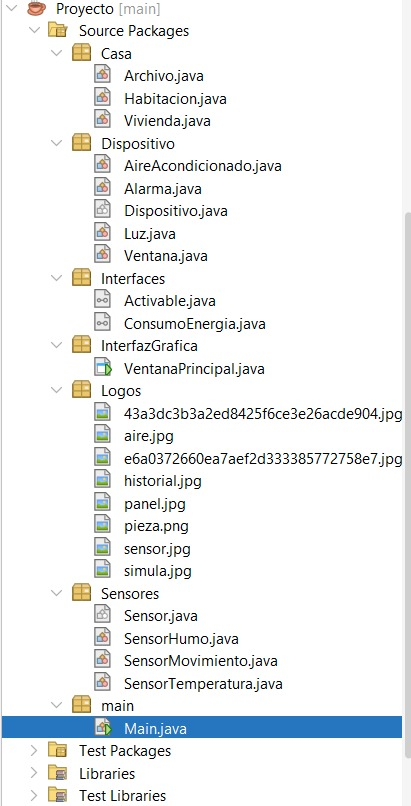
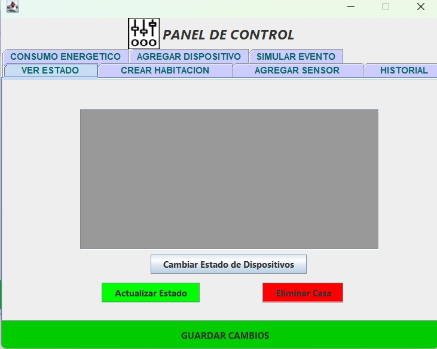

# 🏠 Casa Inteligente - Sistema de Control Domótico

## 📝 1. Descripción del Problema Abordado

En la actualidad, la automatización y gestión eficiente de la energía y seguridad en hogares (Domótica) es una necesidad creciente. El problema abordado en este proyecto consiste en el diseño e implementación de una aplicación de escritorio que funcione como un **Panel de Control** para una vivienda inteligente.

El sistema simula un entorno real donde el usuario puede administrar de forma dinámica los distintos espacios de una casa, controlando dispositivos activos y monitoreando sensores de medición. La aplicación resuelve la falta de un entorno integrado al proveer un control interactivo sobre:
* **Habitaciones:** Creación y organización de ambientes físicos dentro de la vivienda.
* **Dispositivos:** Gestión de actuadores que modifican el entorno, tales como sistemas de iluminación (Luz) o climatización (Aire Acondicionado), permitiendo alterar y verificar sus estados (Encendido/Apagado).
* **Sensores:** Incorporación de dispositivos de lectura física en las habitaciones para recolectar datos de simulación.
* **Historial:** Registro detallado de cada acción, simulación o modificación de estado que ocurre en el sistema con herramientas autónomas de mantenimiento.

---

## 📐 2. Arquitectura del Sistema: Diagrama UML

La solución de software sigue los principios de la Programación Orientada a Objetos (POO), estructurando las entidades lógicas separadas de la interfaz de usuario. A continuación se presenta el Diagrama de Clases UML que detalla la herencia, composición y relaciones del sistema:

---

## 📦 3. Estructura de Paquetes (NetBeans Source)

Esta es la organización de los archivos `.java` dentro del proyecto en NetBeans, dividida en paquetes para un desarrollo limpio:

## 🖼️ 4. Capturas de la Interfaz Gráfica

La aplicación cuenta con un diseño de interfaz de escritorio intuitivo, estructurado mediante pestañas organizadas en doble fila para maximizar la usabilidad del panel en una resolución fija de pantalla:

---
